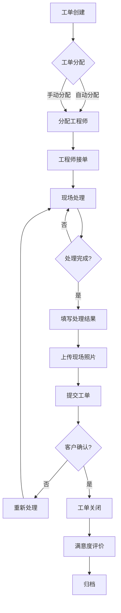
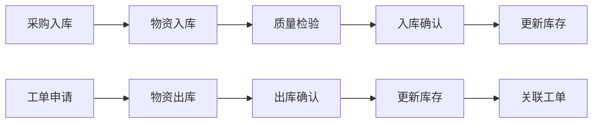
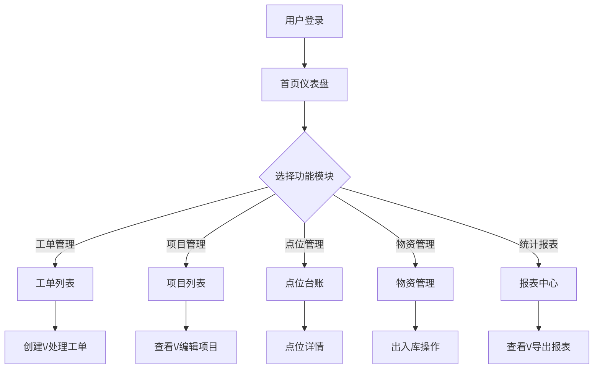

# XX视频监控项目运营管理平台 - 产品需求文档

## 1. 产品概述

[专业的视频监控项目运营管理平台，为安防监控项目提供全面的工单、售后、物资和数据分析管理解决方案]

本平台旨在为视频监控项目运营团队提供一站式管理工具，实现工单流程数字化、点位资料集中化、物资管理规范化、数据统计可视化，全面提升项目管理效率和运营水平。

**目标用户：**
- 项目运营管理人员
- 售后技术支持工程师
- 物资采购与管理人员
- 数据分析与决策人员

## 2. 核心功能

### 2.1 用户角色
| 角色 | 说明 | 核心权限 |
|------|------|----------|
| 系统管理员 | 平台管理员 | 全部功能、系统配置、用户管理 |
| 运营主管 | 项目运营负责人 | 工单管理、报表查看、数据导出 |
| 售后工程师 | 售后点位维护 | 点位资料查看编辑、工单处理 |
| 物资管理员 | 物资管理人员 | 物资出入库、库存管理 |

### 2.2 功能模块

#### 2.2.1 项目点位工单进度实时查询和管理
- **工单创建**：支持创建新工单，选择工单类型（安装、维护、巡检、故障）、优先级、关联项目
- **工单列表**：实时展示所有工单状态，支持多维度筛选（状态、项目、工程师、时间范围）
- **工单详情**：查看工单完整信息包括处理记录、时间节点、附件资料
- **进度跟踪**：实时展示工单当前状态和处理进度，支持甘特图时间线展示
- **工单处理**：工程师可更新工单状态、填写处理结果、上传现场照片
- **消息通知**：工单状态变更自动通知相关人员

#### 2.2.2 项目售后点位资料信息管理
- **项目管理**：项目的增删改查，包含项目基本信息（名称、地址、客户、合同信息）
- **点位台账**：点位信息管理，包括设备型号、安装位置、网络配置、IP地址、负责人
- **设备档案**：设备详细信息记录，包括设备SN码、品牌型号、维保信息
- **地图展示**：支持在地图上展示点位分布情况
- **资料检索**：支持按项目名称、点位名称、IP地址等快速检索
- **附件管理**：支持上传点位相关的图纸、照片、文档资料

#### 2.2.3 项目非集采物资管理
- **物资台账**：物资基本信息管理（名称、规格、型号、单位、分类）
- **入库管理**：物资入库操作，记录供应商、入库时间、数量、单价、批次号
- **出库管理**：物资出库操作，关联项目工单，记录领用人、领用数量
- **库存查询**：实时查询各物资当前库存，支持库存预警设置
- **统计报表**：物资使用统计，支持按项目、按时间、按类别多维度统计
- **供应商管理**：供应商信息维护，包括联系方式、合作历史

#### 2.2.4 项目运营数据统计报表
- **工单统计**：工单总量、已完成、进行中、超时工单数量统计
- **项目统计**：各项目工单分布、项目完成率、项目健康度评估
- **工程师绩效**：工程师处理工单数量、平均处理时长、客户满意度
- **物资消耗**：物资使用量统计、项目物资成本分析
- **趋势分析**：工单量趋势、响应时间趋势、物资消耗趋势
- **数据导出**：支持导出Excel、PDF格式报表
- **自定义报表**：支持根据需求自定义统计维度和展示方式

### 2.3 页面详情

| 页面名称 | 模块名称 | 功能描述 |
|---------|---------|----------|
| 首页仪表盘 | 数据概览 | 展示关键KPI指标卡片、工单状态分布图、近期工单列表、快捷操作入口 |
| 工单管理 | 工单列表 | 展示所有工单，支持筛选、搜索、分页，工单状态标签展示 |
| 工单管理 | 工单详情 | 工单完整信息、时间轴、处理记录、附件展示 |
| 工单管理 | 工单新建/编辑 | 表单创建或编辑工单，支持选择项目、点位、分配工程师 |
| 项目管理 | 项目列表 | 展示所有项目，支持按名称、客户、行业筛选 |
| 项目管理 | 项目详情 | 项目基本信息、关联点位列表、关联工单列表、项目统计 |
| 点位管理 | 点位台账 | 点位列表展示，支持地图模式和列表模式切换 |
| 点位管理 | 点位详情 | 点位详细信息、设备档案、关联工单、维护记录 |
| 物资管理 | 物资台账 | 物资列表，支持分类筛选、低库存预警 |
| 物资管理 | 入库管理 | 入库单创建和列表，扫码入库功能 |
| 物资管理 | 出库管理 | 出库单创建和列表，关联工单出库 |
| 物资管理 | 库存查询 | 库存余额查询，支持多仓库切换 |
| 统计报表 | 工单统计 | 工单数量统计、状态分布、完成率图表 |
| 统计报表 | 项目统计 | 项目工单分布、项目健康度、项目成本分析 |
| 统计报表 | 物资统计 | 物资使用量统计、项目物资成本分析 |
| 系统管理 | 用户管理 | 用户增删改查、角色分配、权限设置 |
| 系统管理 | 字典管理 | 系统字典配置，数据规范化 |

## 3. 核心流程

### 3.1 工单处理流程

### 3.2 物资管理流程

### 3.3 用户操作流程

## 4. 用户界面设计

### 4.1 设计风格
- **整体风格**：现代化企业级管理平台，简洁专业
- **色彩方案**：
  - 主色调：深蓝色 #1E3A5F（科技感、专业、稳重）
  - 辅助色：天蓝色 #3498DB（活力、创新）
  - 强调色：橙色 #F39C12（重要提示、警示）
  - 成功色：绿色 #27AE60（成功状态、完成）
  - 危险色：红色 #E74C3C（紧急、超时、错误）
  - 背景色：浅灰色 #F5F7FA（清爽、专业）
  - 文字色：深灰色 #2C3E50（高可读性）
- **按钮风格**：圆角按钮，悬停阴影效果，主按钮实心样式，次按钮描边样式
- **字体**：思源黑体（Noto Sans SC）作为中文字体，Roboto作为英文和数字字体
- **图标**：Font Awesome图标库，线性风格
- **布局**：左侧导航栏 + 顶部工具栏 + 主内容区，卡片式布局展示数据

### 4.2 页面设计

#### 首页仪表盘
- **顶部统计卡片**：4个KPI卡片（今日工单、总项目数、待处理工单、物资库存预警）
- **中部图表区**：左侧工单状态饼图，右侧本周工单趋势折线图
- **底部列表区**：左侧待处理工单列表，右侧近期操作日志

#### 工单管理页面
- **顶部工具栏**：搜索框、状态筛选、项目筛选、新建工单按钮
- **中部列表**：表格展示工单，支持排序、分页、行操作
- **状态标签**：待处理（橙色）、处理中（蓝色）、已完成（绿色）、超时（红色）

#### 项目管理页面
- **左侧项目树**：按行业或区域分组展示项目
- **右侧详情区**：项目信息卡片、关联点位地图、关联工单列表

#### 物资管理页面
- **顶部Tab切换**：物资台账、入库记录、出库记录、库存查询
- **中部表格**：物资信息列表，支持分类筛选
- **底部统计**：库存预警提示、近期出入库统计

#### 统计报表页面
- **顶部筛选栏**：时间范围选择、项目选择、导出按钮
- **中部图表区**：多种图表展示（柱状图、饼图、折线图）
- **底部数据表**：详细数据表格，支持导出

### 4.3 响应式设计
- **桌面端优先**：主要针对1920x1080分辨率优化
- **平板适配**：1024px以下宽度时左侧导航收起为图标模式
- **移动端适配**：768px以下宽度采用垂直布局，Tab切换替代侧边栏

### 4.4 交互设计
- **加载状态**：骨架屏加载，避免白屏等待
- **操作反馈**：按钮点击涟漪效果，操作成功Toast提示
- **表单验证**：实时验证，错误信息即时展示
- **表格交互**：行悬停高亮，支持多选操作
- **图表交互**：数据点悬停显示详细信息
