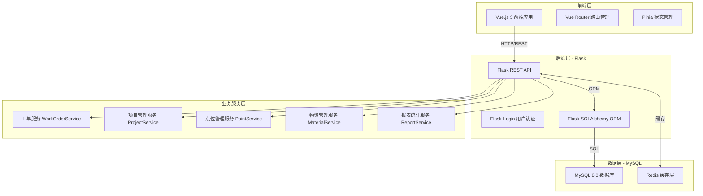
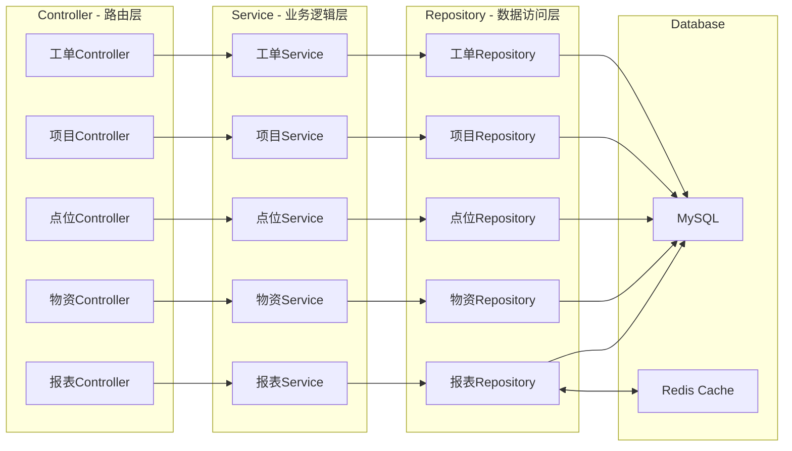
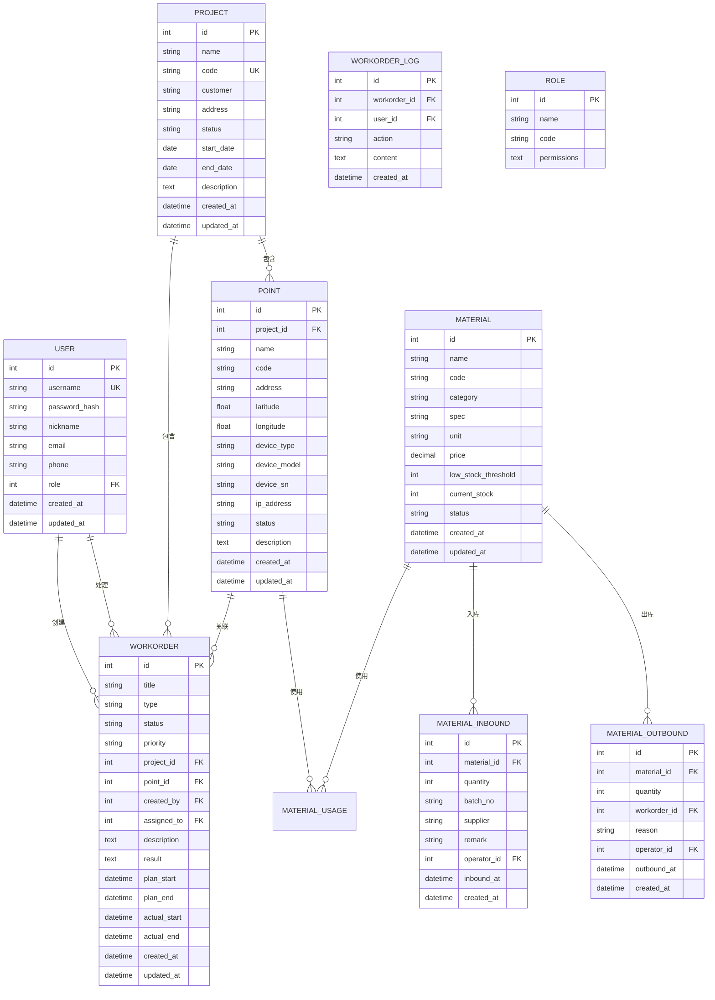

# XX视频监控项目运营管理平台 - 技术架构文档

## 1. 架构设计



## 2. 技术栈描述

### 2.1 前端技术
- **框架**：Vue.js 3 (Composition API)
- **构建工具**：Vite 5
- **路由管理**：Vue Router 4
- **状态管理**：Pinia
- **HTTP客户端**：Axios
- **UI框架**：Element Plus (企业级组件库)
- **图表库**：ECharts
- **表格**：AG Grid Community

### 2.2 后端技术
- **框架**：Flask 2.x
- **ORM**：Flask-SQLAlchemy
- **数据库**：MySQL 8.0
- **缓存**：Redis
- **认证**：Flask-Login + JWT
- **数据验证**：Flask-Marshmallow
- **REST API**：Flask-RESTful
- **任务队列**：APScheduler（定时任务）
- **日志**：Python logging + ELK stack ready

### 2.3 开发工具
- **包管理**：pip + requirements.txt
- **环境管理**：Python venv
- **数据库迁移**：Flask-Migrate (Alembic)
- **代码格式化**：Black + Flake8
- **测试**：pytest + pytest-flask

## 3. 路由定义

### 3.1 认证相关
| 路由 | 方法 | 功能 |
|------|------|------|
| /api/auth/login | POST | 用户登录 |
| /api/auth/logout | POST | 用户登出 |
| /api/auth/register | POST | 用户注册 |
| /api/auth/current-user | GET | 获取当前用户信息 |

### 3.2 工单管理
| 路由 | 方法 | 功能 |
|------|------|------|
| /api/workorders | GET | 获取工单列表 |
| /api/workorders | POST | 创建新工单 |
| /api/workorders/{id} | GET | 获取工单详情 |
| /api/workorders/{id} | PUT | 更新工单 |
| /api/workorders/{id} | DELETE | 删除工单 |
| /api/workorders/{id}/status | PUT | 更新工单状态 |
| /api/workorders/{id}/progress | GET | 获取工单处理进度 |

### 3.3 项目管理
| 路由 | 方法 | 功能 |
|------|------|------|
| /api/projects | GET | 获取项目列表 |
| /api/projects | POST | 创建新项目 |
| /api/projects/{id} | GET | 获取项目详情 |
| /api/projects/{id} | PUT | 更新项目 |
| /api/projects/{id} | DELETE | 删除项目 |
| /api/projects/{id}/points | GET | 获取项目点位列表 |

### 3.4 点位管理
| 路由 | 方法 | 功能 |
|------|------|------|
| /api/points | GET | 获取点位列表 |
| /api/points | POST | 创建新点位 |
| /api/points/{id} | GET | 获取点位详情 |
| /api/points/{id} | PUT | 更新点位 |
| /api/points/{id} | DELETE | 删除点位 |
| /api/points/{id}/history | GET | 获取点位维护历史 |

### 3.5 物资管理
| 路由 | 方法 | 功能 |
|------|------|------|
| /api/materials | GET | 获取物资列表 |
| /api/materials | POST | 创建新物资 |
| /api/materials/{id} | GET | 获取物资详情 |
| /api/materials/{id} | PUT | 更新物资 |
| /api/materials/inbound | POST | 物资入库 |
| /api/materials/outbound | POST | 物资出库 |
| /api/materials/inventory | GET | 查询库存 |
| /api/materials/low-stock | GET | 获取低库存预警 |

### 3.6 报表统计
| 路由 | 方法 | 功能 |
|------|------|------|
| /api/reports/workorder-stats | GET | 工单统计 |
| /api/reports/project-stats | GET | 项目统计 |
| /api/reports/material-stats | GET | 物资统计 |
| /api/reports/export | GET | 导出报表 |

## 4. API 接口定义

### 4.1 认证接口

#### POST /api/auth/login
**请求参数：**
```json
{
  "username": "string",
  "password": "string"
}
```

**响应：**
```json
{
  "success": true,
  "data": {
    "token": "jwt_token_string",
    "user": {
      "id": 1,
      "username": "admin",
      "role": "admin",
      "nickname": "管理员"
    }
  }
}
```

### 4.2 工单接口

#### GET /api/workorders
**查询参数：**
- page: 页码（默认1）
- per_page: 每页数量（默认20）
- status: 工单状态
- project_id: 项目ID
- priority: 优先级
- start_date: 开始日期
- end_date: 结束日期
- keyword: 搜索关键词

**响应：**
```json
{
  "success": true,
  "data": {
    "items": [
      {
        "id": 1,
        "title": "工单标题",
        "type": "maintenance",
        "status": "pending",
        "priority": "high",
        "project_id": 1,
        "project_name": "XX项目",
        "assigned_to": 2,
        "assigned_name": "张三",
        "created_at": "2024-01-15T10:30:00Z",
        "updated_at": "2024-01-15T14:20:00Z"
      }
    ],
    "total": 100,
    "page": 1,
    "per_page": 20,
    "pages": 5
  }
}
```

### 4.3 项目接口

#### GET /api/projects/{id}
**响应：**
```json
{
  "success": true,
  "data": {
    "id": 1,
    "name": "XX视频监控项目",
    "code": "PRJ001",
    "customer": "XX公司",
    "address": "XX市XX区XX路",
    "status": "active",
    "start_date": "2024-01-01",
    "end_date": "2024-12-31",
    "points_count": 50,
    "workorders_count": 120,
    "created_at": "2024-01-01T00:00:00Z"
  }
}
```

## 5. 服务端架构



## 6. 数据模型

### 6.1 数据模型定义



### 6.2 数据定义语言

```sql
-- 用户表
CREATE TABLE users (
    id INT AUTO_INCREMENT PRIMARY KEY,
    username VARCHAR(50) UNIQUE NOT NULL,
    password_hash VARCHAR(255) NOT NULL,
    nickname VARCHAR(50),
    email VARCHAR(100),
    phone VARCHAR(20),
    role_id INT,
    status TINYINT DEFAULT 1,
    created_at DATETIME DEFAULT CURRENT_TIMESTAMP,
    updated_at DATETIME DEFAULT CURRENT_TIMESTAMP ON UPDATE CURRENT_TIMESTAMP,
    INDEX idx_username (username),
    INDEX idx_role (role_id)
) ENGINE=InnoDB DEFAULT CHARSET=utf8mb4;

-- 角色表
CREATE TABLE roles (
    id INT AUTO_INCREMENT PRIMARY KEY,
    name VARCHAR(50) NOT NULL,
    code VARCHAR(50) UNIQUE NOT NULL,
    permissions TEXT,
    created_at DATETIME DEFAULT CURRENT_TIMESTAMP
) ENGINE=InnoDB DEFAULT CHARSET=utf8mb4;

-- 项目表
CREATE TABLE projects (
    id INT AUTO_INCREMENT PRIMARY KEY,
    name VARCHAR(200) NOT NULL,
    code VARCHAR(50) UNIQUE NOT NULL,
    customer VARCHAR(200),
    address VARCHAR(500),
    status VARCHAR(20) DEFAULT 'active',
    start_date DATE,
    end_date DATE,
    description TEXT,
    created_at DATETIME DEFAULT CURRENT_TIMESTAMP,
    updated_at DATETIME DEFAULT CURRENT_TIMESTAMP ON UPDATE CURRENT_TIMESTAMP,
    INDEX idx_code (code),
    INDEX idx_status (status)
) ENGINE=InnoDB DEFAULT CHARSET=utf8mb4;

-- 点位表
CREATE TABLE points (
    id INT AUTO_INCREMENT PRIMARY KEY,
    project_id INT NOT NULL,
    name VARCHAR(100) NOT NULL,
    code VARCHAR(50),
    address VARCHAR(500),
    latitude DECIMAL(10, 6),
    longitude DECIMAL(10, 6),
    device_type VARCHAR(50),
    device_model VARCHAR(100),
    device_sn VARCHAR(100),
    ip_address VARCHAR(50),
    status VARCHAR(20) DEFAULT 'active',
    description TEXT,
    created_at DATETIME DEFAULT CURRENT_TIMESTAMP,
    updated_at DATETIME DEFAULT CURRENT_TIMESTAMP ON UPDATE CURRENT_TIMESTAMP,
    FOREIGN KEY (project_id) REFERENCES projects(id) ON DELETE CASCADE,
    INDEX idx_project (project_id),
    INDEX idx_code (code),
    INDEX idx_status (status)
) ENGINE=InnoDB DEFAULT CHARSET=utf8mb4;

-- 工单表
CREATE TABLE workorders (
    id INT AUTO_INCREMENT PRIMARY KEY,
    title VARCHAR(200) NOT NULL,
    type VARCHAR(20) NOT NULL COMMENT 'install/maintenance/inspection/fault',
    status VARCHAR(20) DEFAULT 'pending' COMMENT 'pending/processing/completed/cancelled',
    priority VARCHAR(20) DEFAULT 'normal' COMMENT 'low/normal/high/urgent',
    project_id INT NOT NULL,
    point_id INT,
    created_by INT NOT NULL,
    assigned_to INT,
    description TEXT,
    result TEXT,
    plan_start DATETIME,
    plan_end DATETIME,
    actual_start DATETIME,
    actual_end DATETIME,
    created_at DATETIME DEFAULT CURRENT_TIMESTAMP,
    updated_at DATETIME DEFAULT CURRENT_TIMESTAMP ON UPDATE CURRENT_TIMESTAMP,
    FOREIGN KEY (project_id) REFERENCES projects(id),
    FOREIGN KEY (point_id) REFERENCES points(id),
    FOREIGN KEY (created_by) REFERENCES users(id),
    FOREIGN KEY (assigned_to) REFERENCES users(id),
    INDEX idx_project (project_id),
    INDEX idx_status (status),
    INDEX idx_assigned (assigned_to),
    INDEX idx_created (created_at)
) ENGINE=InnoDB DEFAULT CHARSET=utf8mb4;

-- 工单日志表
CREATE TABLE workorder_logs (
    id INT AUTO_INCREMENT PRIMARY KEY,
    workorder_id INT NOT NULL,
    user_id INT NOT NULL,
    action VARCHAR(50) NOT NULL,
    content TEXT,
    created_at DATETIME DEFAULT CURRENT_TIMESTAMP,
    FOREIGN KEY (workorder_id) REFERENCES workorders(id) ON DELETE CASCADE,
    FOREIGN KEY (user_id) REFERENCES users(id),
    INDEX idx_workorder (workorder_id)
) ENGINE=InnoDB DEFAULT CHARSET=utf8mb4;

-- 物资表
CREATE TABLE materials (
    id INT AUTO_INCREMENT PRIMARY KEY,
    name VARCHAR(100) NOT NULL,
    code VARCHAR(50) UNIQUE NOT NULL,
    category VARCHAR(50),
    spec VARCHAR(100),
    unit VARCHAR(20) DEFAULT '个',
    price DECIMAL(10, 2) DEFAULT 0.00,
    low_stock_threshold INT DEFAULT 10,
    current_stock INT DEFAULT 0,
    status VARCHAR(20) DEFAULT 'active',
    created_at DATETIME DEFAULT CURRENT_TIMESTAMP,
    updated_at DATETIME DEFAULT CURRENT_TIMESTAMP ON UPDATE CURRENT_TIMESTAMP,
    INDEX idx_code (code),
    INDEX idx_category (category),
    INDEX idx_status (status)
) ENGINE=InnoDB DEFAULT CHARSET=utf8mb4;

-- 物资入库表
CREATE TABLE material_inbounds (
    id INT AUTO_INCREMENT PRIMARY KEY,
    material_id INT NOT NULL,
    quantity INT NOT NULL,
    batch_no VARCHAR(50),
    supplier VARCHAR(100),
    remark TEXT,
    operator_id INT NOT NULL,
    inbound_at DATETIME DEFAULT CURRENT_TIMESTAMP,
    created_at DATETIME DEFAULT CURRENT_TIMESTAMP,
    FOREIGN KEY (material_id) REFERENCES materials(id),
    FOREIGN KEY (operator_id) REFERENCES users(id),
    INDEX idx_material (material_id),
    INDEX idx_inbound_at (inbound_at)
) ENGINE=InnoDB DEFAULT CHARSET=utf8mb4;

-- 物资出库表
CREATE TABLE material_outbounds (
    id INT AUTO_INCREMENT PRIMARY KEY,
    material_id INT NOT NULL,
    quantity INT NOT NULL,
    workorder_id INT,
    reason VARCHAR(200),
    operator_id INT NOT NULL,
    outbound_at DATETIME DEFAULT CURRENT_TIMESTAMP,
    created_at DATETIME DEFAULT CURRENT_TIMESTAMP,
    FOREIGN KEY (material_id) REFERENCES materials(id),
    FOREIGN KEY (workorder_id) REFERENCES workorders(id),
    FOREIGN KEY (operator_id) REFERENCES users(id),
    INDEX idx_material (material_id),
    INDEX idx_outbound_at (outbound_at)
) ENGINE=InnoDB DEFAULT CHARSET=utf8mb4;

-- 数据字典表
CREATE TABLE dicts (
    id INT AUTO_INCREMENT PRIMARY KEY,
    category VARCHAR(50) NOT NULL,
    code VARCHAR(50) NOT NULL,
    name VARCHAR(100) NOT NULL,
    sort_order INT DEFAULT 0,
    status TINYINT DEFAULT 1,
    created_at DATETIME DEFAULT CURRENT_TIMESTAMP,
    UNIQUE KEY uk_category_code (category, code)
) ENGINE=InnoDB DEFAULT CHARSET=utf8mb4;

-- 系统配置表
CREATE TABLE configs (
    id INT AUTO_INCREMENT PRIMARY KEY,
    config_key VARCHAR(100) UNIQUE NOT NULL,
    config_value TEXT,
    description VARCHAR(200),
    updated_at DATETIME DEFAULT CURRENT_TIMESTAMP ON UPDATE CURRENT_TIMESTAMP
) ENGINE=InnoDB DEFAULT CHARSET=utf8mb4;
```

## 7. 项目目录结构

```
/workspace/
├── app/
│   ├── __init__.py              # Flask应用工厂
│   ├── config.py                # 配置文件
│   ├── extensions.py            # 扩展初始化
│   ├── models/                  # 数据模型
│   │   ├── __init__.py
│   │   ├── user.py
│   │   ├── project.py
│   │   ├── point.py
│   │   ├── workorder.py
│   │   ├── material.py
│   │   └── dict.py
│   ├── api/                     # API接口
│   │   ├── __init__.py
│   │   ├── auth.py
│   │   ├── workorder.py
│   │   ├── project.py
│   │   ├── point.py
│   │   ├── material.py
│   │   └── report.py
│   ├── services/                # 业务逻辑
│   │   ├── __init__.py
│   │   ├── workorder_service.py
│   │   ├── project_service.py
│   │   ├── point_service.py
│   │   ├── material_service.py
│   │   └── report_service.py
│   ├── schemas/                 # 数据验证
│   │   ├── __init__.py
│   │   ├── workorder_schema.py
│   │   ├── project_schema.py
│   │   └── material_schema.py
│   └── utils/                   # 工具函数
│       ├── __init__.py
│       ├── decorators.py
│       └── helpers.py
├── static/                      # 静态文件
│   ├── css/
│   ├── js/
│   └── images/
├── templates/                   # 模板文件
│   └── index.html
├── migrations/                  # 数据库迁移
├── tests/                       # 测试文件
│   ├── __init__.py
│   ├── test_auth.py
│   ├── test_workorder.py
│   └── test_material.py
├── .env                         # 环境变量
├── requirements.txt             # 依赖
├── run.py                       # 应用入口
└── README.md                    # 项目说明
```

## 8. 安全考虑

### 8.1 认证与授权
- JWT Token认证，支持Token刷新
- 基于角色的权限控制（RBAC）
- 密码加密存储（bcrypt）
- API访问频率限制

### 8.2 数据安全
- SQL注入防护（ORM自动处理）
- XSS防护（前端转义）
- CSRF防护
- 敏感数据加密

### 8.3 日志与监控
- 操作日志记录
- 异常日志追踪
- 性能监控预留

## 9. 性能优化

### 9.1 数据库优化
- 合理建立索引
- 查询结果分页
- 使用Redis缓存热点数据
- 定期清理过期数据

### 9.2 前端优化
- 路由懒加载
- 组件异步加载
- 图片压缩和CDN
- 浏览器缓存策略
